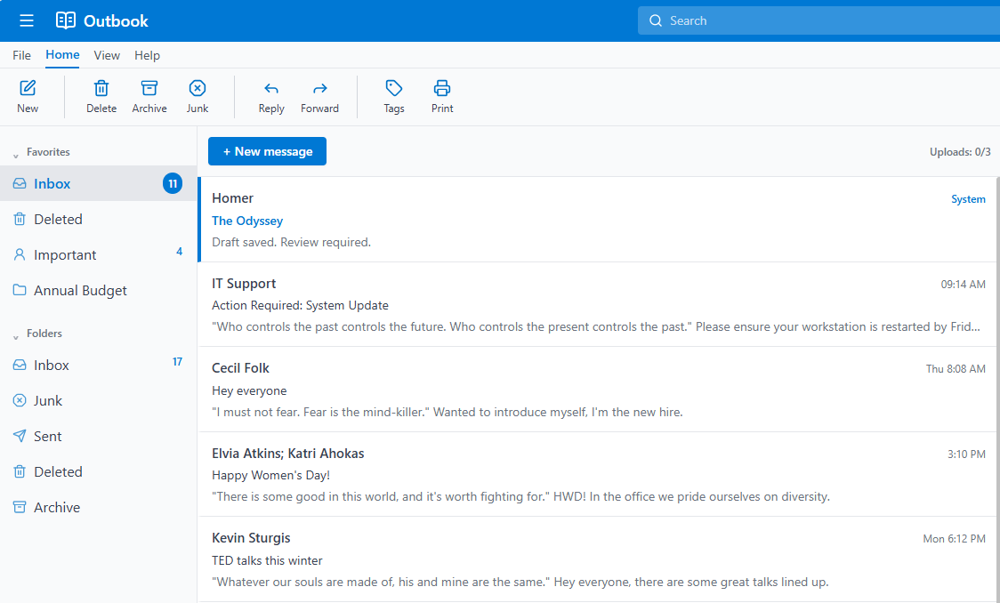

# Outbook

A local-first ePub reader disguised as a familiar inbox. No uploads, no accounts, no server.

## Features
- **Disguise:** Redesigned interface featuring Office-style ribbon toolbars, favorites, and realistic dummy inbox items with literature easter eggs.
- **Customizer Toolbar:** Adjust fonts (Segoe UI, Georgia, Inter, Courier), font sizing (A- / A+), and line spacing on the fly.
- **Enhanced Reading Metrics:** Real-time page counters, exact completion percentages, and a visual progress bar fill beneath the header.
- **Persistent Local Caching:** Powered by IndexedDB and `localStorage` so your books and exact reading position persist across browser refreshes without server storage.
- **Keyboard Navigation:** Use `J` / `K` or arrow keys to flip pages seamlessly like scrolling through emails.

## Try It Live
👉 **[www.outbook.online](http://outbook.online/)**

## Legal
Not affiliated with Microsoft or Outlook.

## Support the Project
If you enjoy using Outbook and want to support its ongoing development, feel free to buy me a coffee!

☕ **[Buy Me a Coffee](https://www.buymeacoffee.com/Sachmer)**
